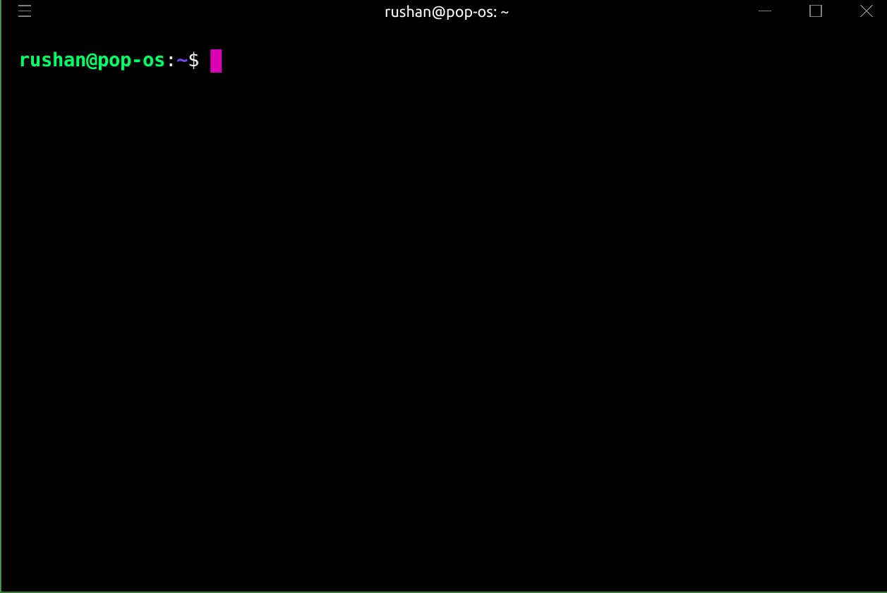

#                           Codemon 

[](https://gitter.im/codemon-py/community?utm_source=badge&utm_medium=badge&utm_campaign=pr-badge&utm_content=badge)

### A CLI tool to ace Competitive Programming Contests.

Mostly, the time of a competitive programmer is wasted in compiling, adding inputs, 
and debugging. Typing commands again and again wastes time, which we cannot afford 
during a contest. 

#### Codemon takes care of everything else so that you only focus on writing correct code and implementing complex algorithms.

Note: Codemon currently supports C++ only. 

<br>
<p align="center">
  
</p>
<br>

## How to install ?
#### Make sure you have pip, python and setuptools installed.
- To install setuptools, use `pip install setuptools`
- Type `git clone https://github.com/ankingcodes/codemon.git` to clone the package
- Type `cd codemon`
- Type `sudo python3 setup.py install`
- Type `sudo python setup.py bdist_wheel`
- Install the package locally using `pip install .`
  
  This command will place `codemon` executable at `/usr/local/bin` so that it can 
  be executed anywhere.
- Type `codemon` and you are ready to go.

## CLI - commands
   ```
   codemon init <contestName>
   ```
    
  This creates a directory with the name of the contest and creates 6 `.cpp` files 
  as per contests in CodeForces.
  You can also create a file with custom name and start listening to it immediately using the command as follows: 
  ```
  codemon init -n <fileName>
  ```

  Copy your inputs for a respective coding question to the `input.txt` file.

  ```
  codemon listen 
  ```

  Type this command inside the directory of the contest(`cd contestName`). 
  It will start listening for changes in any of the files. Make changes to any 
  of the `.cpp` files and save it. 
  As soon as a file is saved, codemon recognizes it, compiles it and produces 
  output corresponding to the `input.txt` file. 

  Works flawlessly with VSCode.

## Contributions 
Don't hesitate to create issues and PRs for improving codemon. 
All contributions are welcome 
